**Design and Implementation**

**INRODUCTION:**

The previous chapter examined several current grid topologies and provided insights into their complexities, benefits, and drawbacks. Building on this framework, this chapter takes a simulation trip to thoroughly examine the suggested model. This project is accompanied by a detailed specification of its constituent parts, with the goal of clarifying their functions and roles in the system. In the domain of this study, two discrete model topologies G2V and V2L assume central roles, each exhibiting certain traits and opportunities. This chapter aims to shed light on the viability and effectiveness of the suggested paradigm in tackling current grid systems difficulties via the lenses of simulation and in-depth component analysis.

**Overview of G2V Topology:**

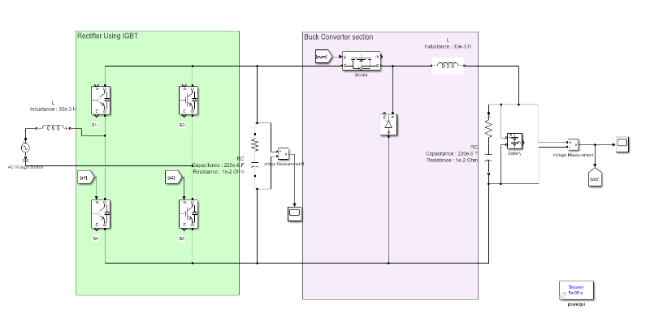The model is powered by a 230V AC input drawn from the grid when operating in G2V mode. The incoming AC voltage is rectified to DC using an IGBT-based rectifier. The DC voltage is then adjusted to the nominal voltage needed for the battery by passing it through a buck converter section. This circuit implementation combines many control circuits that are in charge of producing pulses for the buck converter and rectifier functions. The next sections go into further detail on the complex operation of these control circuits.

_Figure 1 : Simulation circuit for G2V mode of operation_

**Components of the Proposed G2V Model and their specifications**

Many parts of this simulation circuit are crucial in determining how well it functions. Every element is carefully explained, including in-depth descriptions of its working principles, parameterization, and ensuing effects on the system as a whole. Furthermore, thorough explanations of how important these factors are in affecting system behavior and performance results are given.

**EV-Battery**

A 160V nominal voltage lithium-ion battery is incorporated into the circuit in this simulation. The battery's starting energy level is represented by a state of charge (SoC) of 5%. The simulation does not account for the impact of aging and temperature changes on battery performance in order to simplify the model. The battery's response time, which is also set to 2 seconds, represents how long it takes the battery to modify its output in response to variations in the load or operating environment.

**Rectifier**

An IGBT-based rectifier, which is characterized by its advanced operational characteristics and enhanced controllability, facilitates the rectification process. The rectifier demonstrates a number of noteworthy benefits over conventional rectification techniques by utilizing Insulated Gate Bipolar Transistor (IGBT) technology. These benefits include reduced harmonic distortion, increased efficiency, better dynamic responsiveness, and increased control precision. In addition to improving the circuit's overall performance, the use of IGBT-based rectification demonstrates a dedication to utilizing cutting-edge technologies for the best possible system performance.

**Buck Converter**

In order to match the battery's nominal voltage, the buck converter portion used in this simulation steps down the voltage. The main switching devices used to complete this important work are MOSFETs, which are renowned for their quick switching rates and effective performance. The MOSFETs' switching pulses are produced by a feedback control circuit that carefully modifies the duty ratio to control the output voltage in accordance with the target set point.

**Pulse Generation Control Circuit for Buck-Converter**

The control circuit is made up of a number of essential parts that work together to precisely control the output voltage of the buck converter. First, the output voltage is compared to a reference voltage, and a proportional-integral (PI) controller is used to process the error signal that results. This controller can efficiently decrease steady-state error and assure quick reaction to dynamic load changes because of its proportional gain (Kp) and integral gain (Ki) values, which are set at 0.1 each.

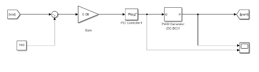

_Figure 2: Control Circuit r to generate pulses for Mosfet in buck converter._

The output of the PI controller is then subjected to additional processing via a gain stage with a factor of 0.08 in order to fine-tune the control signal in order to comply with the demands of the following stages. Ultimately, a pulse-width modulation (PWM) generator receives the processed control signal, which now represents the intended duty ratio.
At a frequency of 15 kHz, the PWM generator produces pulses with different widths that are proportionate to the duty ratio. The buck converter's MOSFET switches use these pulses as control signals to efficiently regulate the flow of energy and keep the output voltage at the intended level.

**Pulse Width Modulation Control Circuit for Rectifier Circuit.**

In the control circuit of the rectifier, the standard sinusoidal pulse-width modulation (PWM) technique is employed. Initially, a sinusoidal waveform with a peak amplitude of 1V and a frequency of 50 Hz serves as a reference signal. This sinusoidal signal is compared with a triangular waveform sequence.

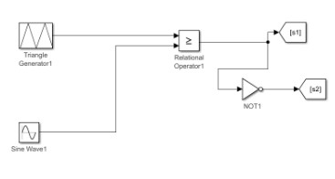

_Figure 3: Pulse width modulation control circuit for rectifier circuit._

A pulse is produced when the triangle waveform exceeds or crosses the sinusoidal signal. On the other hand, pulse creation stops when the triangle waveform crosses the sinusoidal signal or falls below it.

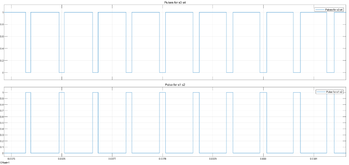

_Figure 4: Output pulses from the control circuit._

**Overview of V2L Topology**

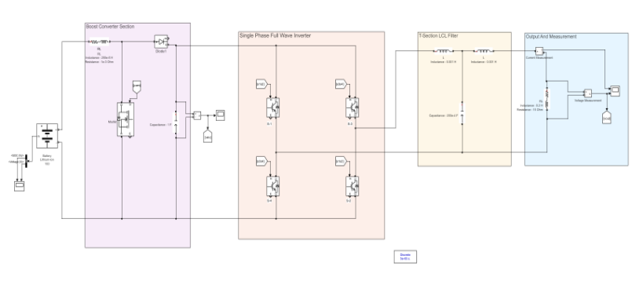A boost converter raises the voltage of the 160V battery at the start of the circuit path in the Vehicle-to-Load (V2L) topology. The DC voltage level is raised by this boost converter to satisfy the demands of later stages. The DC voltage is sent into a full-wave inverter after the boost conversion, where it is transformed into alternating current (AC).

A T-section LCL filter is used to reduce the amount of harmonics in the output waveform and provide an output that is almost sinusoidal. This filter setup ensures that the output waveform closely mimics a sinusoidal waveform by effectively attenuating undesirable harmonics present in the waveform. The V2L architecture uses the LCL filter to improve the generated AC signal quality so that it can power loads that have strict waveform purity and stability requirements.

**Components of the Proposed V2L Model and their specifications**

Several elements of the V2L simulation circuit are crucial in determining how well it functions. Every component is explained in great detail, including explanations of how it functions, how it is parameterized, and how it affects system dynamics. Furthermore, thorough explanations of how important these elements are in determining the general behavior of the system and its performance results are given.

**Inverter Circuit**

A typical single-phase full-wave inverter, which is an essential part of converting DC to AC power, is included in the V2L modeling circuit. A control circuit governs the pulse-width modulation (PWM) signals applied to the switching devices of this inverter, hence controlling its functioning. The inverter produces an AC output waveform that nearly approaches the intended sinusoidal waveform by precisely controlling the PWM signals. This procedure guarantees the battery's DC power is converted into AC power that may be used to power external loads in an effective and dependable manner.

**Pulse Width Modulation Control Circuit for Inverter Circuit**

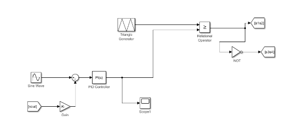The V2L topology's control circuit maintains intended performance by continuously monitoring and adjusting the output voltage in a closed-loop manner. The output voltage is first sent back and subsequently processed by the intended gain step. Next, this modified voltage is contrasted with a reference signal that is an ideal sine wave.

To fine-tune the control signal, the comparison result is then fed through a proportional-integral (PI) controller. By successfully correcting any variation between the required reference and the actual output, the PI controller reduces error and enhances system stability.

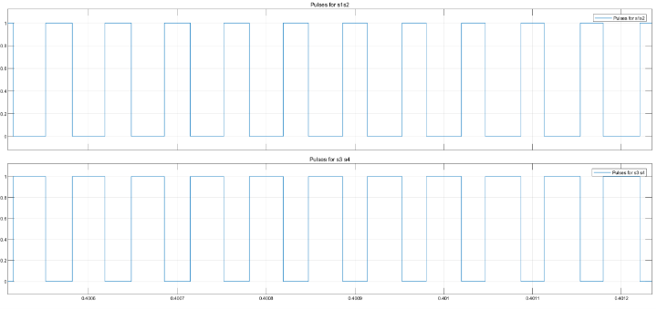

_Figure 7: Output pulses from the control circuit._

Lastly, a triangle generator's produced triangle waveform is compared to the PI controller's output. The comparison produces the pulse-width modulation (PWM) signals needed to regulate the inverter's switches. The inverter efficiently creates the required AC output waveform by synchronizing the PWM impulses with the triangle waveform, guaranteeing a dependable and effective conversion of DC to AC power.

**Boost Converter**

The boost converter section of the V2L topology serves to elevate the DC voltage sourced from the battery to match the reference DC bus voltage required for subsequent stages. This process is facilitated by a control circuit responsible for generating the necessary switching pulses.

**Pulse Generation for Boost Converter**

Precise management of the output voltage is largely dependent on the boost converter control circuit. First, the output voltage is measured against a reference voltage. A proportional-integral (PI) controller processes the resulting error signal.

With its proportional gain (Kp) and integral gain (Ki) values set at 0.1 each, the PI controller guarantees a quick reaction to dynamic load variations while also efficiently lowering steady-state error. This modifies the boost converter's duty cycle, allowing for effective voltage regulation.

The PI controller's output is then further adjusted using a gain stage with a factor of 0.008 to adjust the control signal in accordance with the demands of the stages that follow.

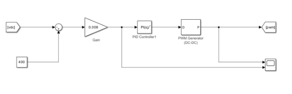

_Figure 8: Control Circuit to generate pulses for Mosfet in buck converter._

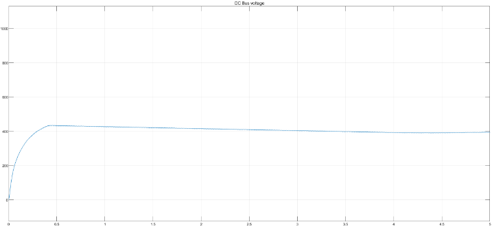

_Figure 9: Output DC bus voltage with reference value as 400v._

**T-Section LCL Filter**

A T-section LCL filter is incorporated into the V2L topology's final stage to reduce harmonic distortion in the output waveform. The inductance and capacitance components in this filter architecture work together to efficiently suppress undesired harmonics.
In particular, the capacitance value is changed to 200µF and the inductance value is set to 1mH. A cleaner, more sinusoidal output waveform is produced by the LCL filter's effective suppression of harmonic content .

**Conclusion**

In conclusion, reliable systems for enabling energy exchange between electric vehicles and the grid are represented by both the G2V and V2L topologies. Components like the boost converter and full-wave inverter, which are powered by complex control circuits to regulate voltage and guarantee effective power conversion, are expertly designed and flawlessly integrated in both topologies. T-section LCL filters are also included in both topologies, which further refines the output waveform and reduces harmonics while improving system performance overall. In the field of electric vehicle technology, the G2V and V2L topologies both present promising means of facilitating grid compatibility and permitting sustainable energy integration thanks to their sophisticated features and accurate control mechanisms.

**RESULT AND DISCUSSION**

**INTRODUCTION**

The previous chapters covered the numerous parameters and control circuitry required to get the desired output, as well as a thorough discussion of the design and implementation of the suggested model. With the use of MATLAB's FFT analyzer tool, this chapter aims to go deeper into the examination of the output waveforms, paying particular attention to their frequency characteristics. To further evaluate the system's performance under various load circumstances, a comparison analysis of the outcomes in V2L mode under various loads will be carried out. In addition, a close examination of the ripple that appears in the output DC waveform while operating in G2V mode will be conducted. Through this research, we want to learn important things about how the built model behaves and performs under various load scenarios and operational modes.

**OUTPUT WAVEFORM IN V2L MODE WITH RL-LOAD**

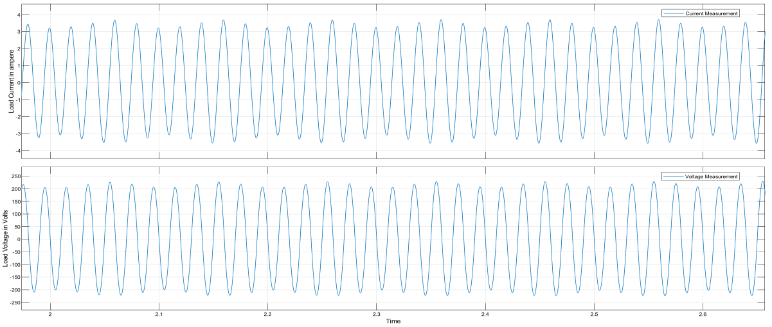When a V2L (Voltage-to-Load) converter is used with an RL (Resistor-Inductor) load arrangement, the output voltage that is produced has a waveform that is almost sinusoidal in shape. Concurrently, the corresponding load current also exhibits a sinusoidal waveform. Specifically, because the load is inductive, there is a phase shift between the voltage and current waveforms. This phase difference is caused by the intrinsic reactance that the load circuitry's inductance component introduces.

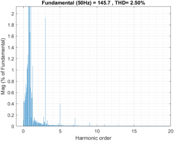There is a dynamic range of +220 volts to -220 volts in the voltage waveform. Additionally, a significant reduction in harmonic distortion in the output waveform is accomplished by utilizing advanced control techniques in combination with the incorporation of an LCL (Inductor-Capacitor-Inductor) filter. By effectively attenuating undesired harmonic components, this synergistic combination improves the overall quality of the waveform. By using Fourier Transform-based approaches, specifically the Fast Fourier Transform (FFT)

Spectrum analysis method, the effectiveness of the applied control mechanisms and filter design may be identified and thoroughly examined. The spectral analysis of the waveform reveals the presence of specific harmonics, notably the 3rd, 5th, and 7th harmonics. Despite their existence, these harmonics collectively constitute less than 2% of the fundamental component within the waveform. Additionally, in proximity to the fundamental frequency, disturbances exert their influence, augmenting the composite effect of the odd harmonics. It is noteworthy that these disturbances, in conjunction with the odd harmonics, contribute to the determination of the Total Harmonic Distortion (THD) of the waveform.

The calculated THD value, which is 2.5%, represents a measurement of the waveform's harmonic distortion. This THD result, astonishingly, indicates a markedly better performance when compared to typical inverter designs. The measured total harmonic distortion (THD) value highlights how well the control strategies and filtering methods used to reduce harmonic distortion also improve the overall waveform quality and meet strict performance requirements.

The examination of voltage dynamics and Battery State of Charge (SOC) reveals discrete operating phases, both transient and steady-state. First, under temporary circumstances, there is a noticeable increase in load current. This spike represents the system's first reaction to load demands, which is marked by a quick phase of correction.

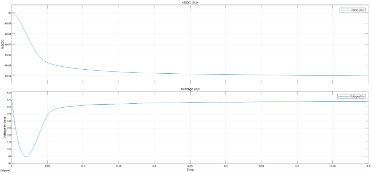As soon as the system enters a steady-state domain, it stabilizes and power is delivered from the battery at a nominal voltage level that is almost constant. This stage denotes the creation of a stable equilibrium between battery supply and load demand. The system effectively satisfies load requirements during this time while preserving voltage stability at the designated nominal level.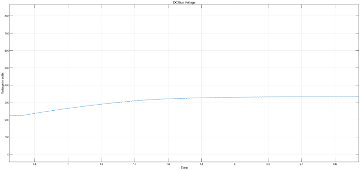

As the system stabilizes, there are fluctuations and adjustments to the DC bus voltage during the transient phase of the RL (Resistor-Inductor) load design. Nevertheless, the DC bus voltage achieves a steady-state condition once the transient phase ends. This amount of stable voltage acts as the inverter's main input, making it easier to convert DC power into AC output.
The DC bus voltage in the RL load design is noteworthy for having very little ripple. There are various benefits associated with the low ripple characteristic. First of all, it shows that the DC source is providing a steady and continuous power supply, which guarantees the succeeding inverter stage operates dependably. Second, the decreased ripple helps to lessen the inverter's harmonic distortion of the AC waveform.

**OUTPUT WAVEFORM IN V2L MODE WITH R-LOAD**

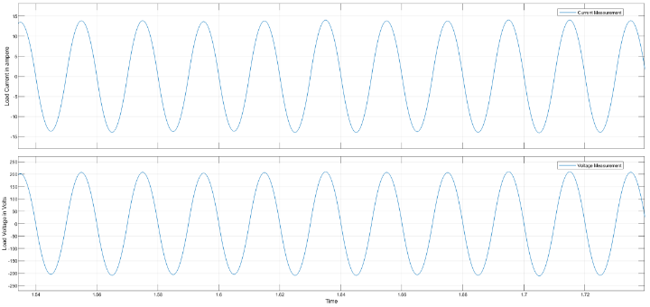The waveform characteristics are similar to those seen in the RL (Resistor-Inductor) load situation when using the V2L (Voltage-to-Load) mode of operation with a R (Resistor) load configuration. Still, significant variances arise mainly in the current profile, which can be attributed to the intrinsic variations in load impedance.
In particular, compared to its RL counterpart, the R load configuration produces a waveform with a larger magnitude of load current. The increased current intensity can be directly attributed to the R load's lower impedance. Although this change in load impedance causes little oscillations in the waveform, a thorough examination is necessary to determine its exact consequences, especially using FFT (Fast Fourier Transform) spectrum methods.

The FFT spectrum analysis makes it easier to identify and measure any spectral changes brought about by the changed load impedance. Through close examination of the waveform's frequency domain representation, minor anomalies, harmonics, and spectral components resulting from the modified load impedance can be located and detailed. A closer look at the FFT spectrum reveals that some well-known harmonics—the 3rd, 5th, and 7th—remain in the waveform, but their combined contribution to the base frequency is less than 2%. This conclusion is consistent with previous research and emphasizes how resilient the V2L system is at reducing harmonic distortion regardless of load fluctuations.

Notably, the output waveform's root mean square (RMS) value increases when a R (Resistor) load arrangement is used. The lower impedance features of the R load configuration are directly responsible for this increase in 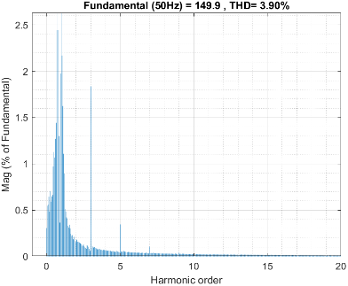RMS amplitude. Consequently, this allows the system to handle larger load current values, which raises the output waveform's total RMS value. There is a notable consistency between the RL (Resistor-Inductor) load configuration and the R (Resistor) load configuration when the State of Charge (%SOC) and voltage of the 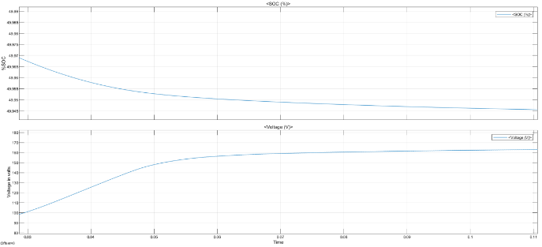battery are analyzed over time. More specifically, under both load circumstances, there is very little variation in

the battery's voltage characteristics and percentage SOC.
This consistency suggests that, irrespective of the type of load applied to the V2L system, the battery functions with almost the same characteristics. The battery subsystem's resilience and dependability are highlighted by the consistency of its %SOC and voltage behavior, which sustains steady performance and output characteristics regardless of load fluctuations.

The idea of consistent system behavior independent of load fluctuations is further supported by the DC bus voltage's consistency across both the R (Resistor) and RL (Resistor-Inductor) load configurations. The DC bus voltage stability in the V2L system indicates a strong power management architecture.
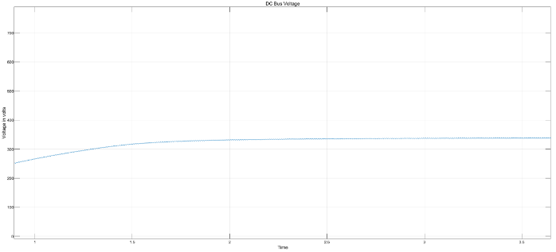
The maintenance of a consistent DC bus voltage level emphasizes how well the voltage management mechanisms in the system work. These regulatory mechanisms guarantee that the DC bus voltage stays within predetermined operational limits, regardless of the kind of load. This promotes dependable and uniform power conversion operations.

**OUTPUT WAVEFORM IN G2V MODE**

When operating in the Grid-to-Vehicle (G2V) mode, the output voltage primarily displays a DC (Direct Current) profile with little ripple or transient oscillations. The vehicle's battery system can be effectively charged thanks to this steady DC output.

The output voltage ripple and small transient impacts suggest that the V2L (vehicle-to-load) system's power conversion process is well-regulated. The integrity and lifespan of the car's battery depend on this kind of output voltage steadiness. The vehicle's battery is charged at its nominal voltage once this steady DC output has been produced. The nominal voltage is the battery's ideal operating voltage range, which ensures efficient charging without overtaxing or stressing the battery.

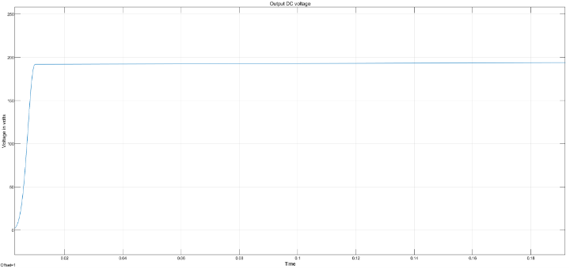

_Figure 8: Output DC voltage at the battery terminals_

The DC bus voltage in the G2V mode of operation closely resembles the features of the output voltage. The DC bus voltage normally stays higher before the power conversion circuit's buck (step-down) segment. The circuitry that controls the voltage dynamically, according to the output's requirements, is responsible for this first voltage increase.
The control circuitry makes sure that the DC bus voltage is changed appropriately to preserve compatibility and synchronization with the output voltage while the output voltage is regulated and conditioned. By ensuring that the DC bus voltage stays within predetermined bounds, this control circuit's dynamic behavior maximizes the power conversion process's stability and efficiency. Furthermore, the control circuitry is essential for reducing ripple and transient effects in the DC bus voltage, which enhances the G2V operation's overall stability and dependability. Through constant observation and modification of the DC bus voltage in reaction to changes in load and system dynamics, the management circuitry enables smooth power transmission from the grid to the vehicle's battery system, hence improving performance and efficiency while maintaining battery integrity.

**CONCLUSION**

Conclusively, the examination of the diverse operational modes and load configurations of the Vehicle-to-Load (V2L) system highlights its flexibility and adaptability in enabling two-way power transfer between vehicles and external loads. Several important conclusions have been drawn from the analysis of V2L modes, including V2G (Vehicle-to-Grid), V2H (Vehicle-to-Home), and G2V (Grid-to-Vehicle), as well as load configurations, which include RL (Resistor-Inductor) and R (Resistor) configurations.

The V2L system has strong performance characteristics in a variety of operational settings, which are supported by advanced control and power conversion techniques. The output voltage exhibits stability and consistency in both V2L and G2V modes, which is necessary for effective power distribution to external loads or vehicle batteries. In addition, the control circuitry dynamically regulates the DC bus voltage to minimize transient effects and guarantee alignment with output requirements.
